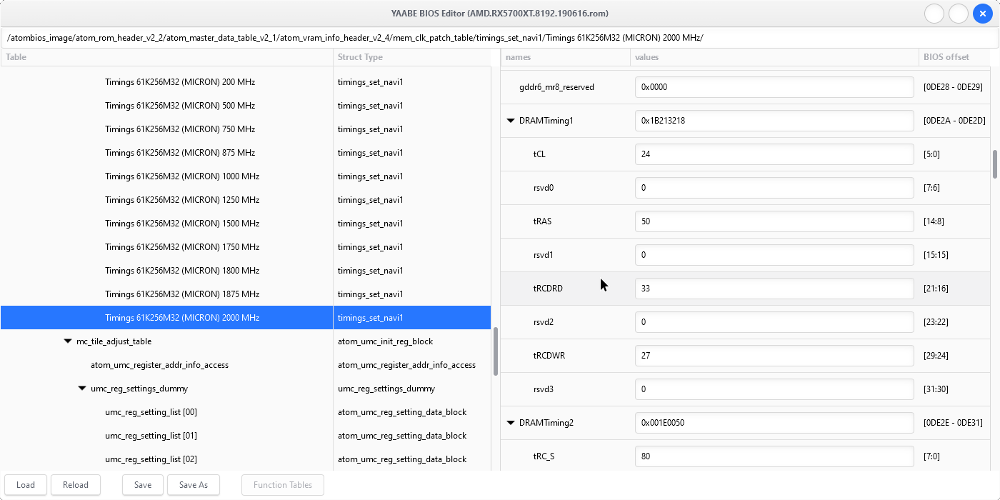

# Yet Another AtomBIOS Editor



YAABE is an AMD/ATI GPU VBIOS editor with a major focus on exposing the full
data structures of the VBIOS, rather than just the notable tidbits an
overclocker may want.

This VBIOS editor does not hold your hand; it exposes a lot and you should have
an idea what you're looking for and what it does. It is recommended to view the
header files under `atom/` in tandem.

## TODO

This BIOS editor is still in its early stages. The most important thing is
simply populating the tables; making ATUI representations for the tables within
`atomfirmware.h` et al. and hooking it up into the atomtree. There is also a
bunch of smaller things to figure out, which can be be found through
`grep -RHine TODO`.

## Compiling

YAABE is compiled with the Meson build system, and uses the (upcoming)
C standard ISO/IEC 9899:2024 (c2x) with GNU extensions (gnu2x),
GTK 4.12 UI toolkit, and json5 for python.

### Linux

Make sure you have the GTK 4 suite and meson installed. For Debian and kin,
```shell
apt-get install libgtk-4-dev python3-json5 meson
```

then,

```shell
meson setup build
cd build && meson compile
```

However, meson is configured by default to make development easier, so if you
wish for a release build,

```shell
meson setup build --buildtype=release -Db_lto=true
cd build && meson compile
```

### Windows

Install [MSYS2](https://www.msys2.org) (MSYS2 must be installed on an NTFS
partition as FAT and ReFS filesystems are incompatible).

Launch MSYS2's UCRT64 environment by running `ucrt64.exe` (you should see a
purple "UCRT64" in your command prompt).

Install UCRT toolchains and the gtk4 libraries,

```shell
pacman -Syuu # update if it's an old install
pacman -S base-devel mingw-w64-ucrt-x86_64-toolchain mingw-w64-ucrt-x86_64-meson mingw-w64-ucrt-x86_64-gtk4 mingw-w64-ucrt-x86_64-python-json5 mingw-w64-ucrt-x86_64-nsis
```

The msys2 shell root `/` is the msys2 install location. Your current working
directory when you open the msys2 shell is your username under `home/`. Plop
the YAABE source in a place you can reach it within msys2, cd to it, and then,

```shell
meson setup build
cd build && meson compile
```

Optionally, it is possible to create an installer wizard through NSIS.
To package a theme, place the theme in `gtk-assets/share/themes/` and edit
`gtk-assets/etc/gtk-4.0/settings.ini` accordingly. That said I do reccomend a
theme, which is linked as a submodule and can be pulled in via
`git submodule init; git submodule update`. Finally,

```shell
meson setup build --buildtype=release -Db_lto=true -Dnsis_installer=true
cd build && meson compile nsis_installer
```


## Useful Resources

https://git.kernel.org/pub/scm/linux/kernel/git/torvalds/linux.git/tree/drivers/gpu/drm/amd

https://github.com/alterapraxisptyltd/openatom

https://github.com/OhGodAPet/amdtimingcopy

https://github.com/IndeedMiners/PolarisBiosEditor

https://www.overclock.net/threads/polaris-bios-editing-rx5xx-rx4xx.1604567/page-271

https://github.com/Eliovp/amdmemorytweak

https://github.com/andybf/atombioseditor

https://github.com/ddobreff/amdmeminfo

https://github.com/nerdralph/OhGodADecode

https://nerdralph.blogspot.com/2017/05/gddr5-memory-timing-details.html

https://www.igorslab.de/red-bios-editor-bios-eintraege-anpassen-optimieren-und-noch-stabiler-uebertakten-navi-unlimited

https://github.com/cyring/CoreFreq

https://www.jedec.org/standards-documents/docs/jesd250d

https://doc.coreboot.org/soc/amd/psp_integration.html
